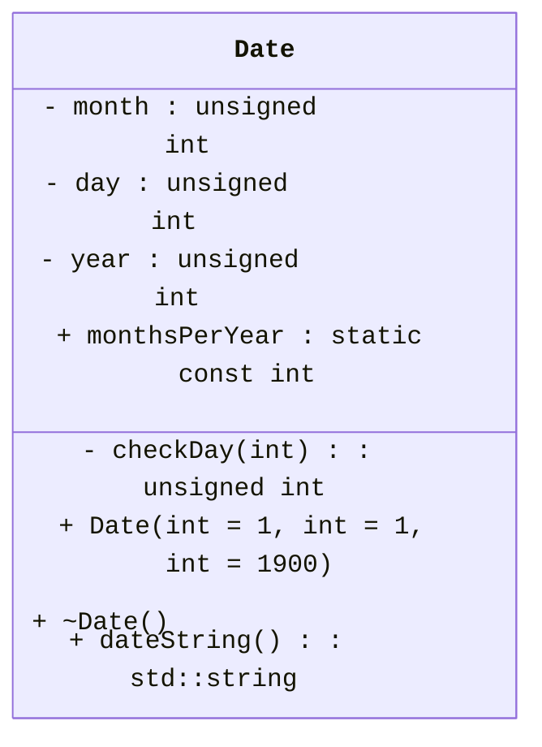
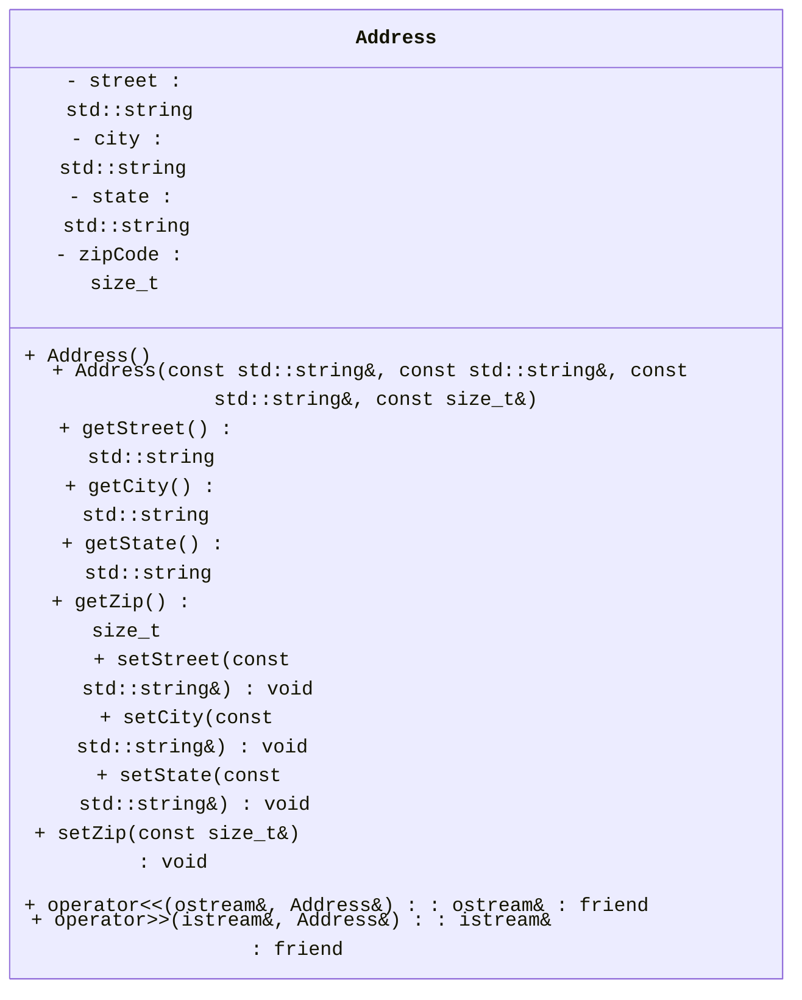
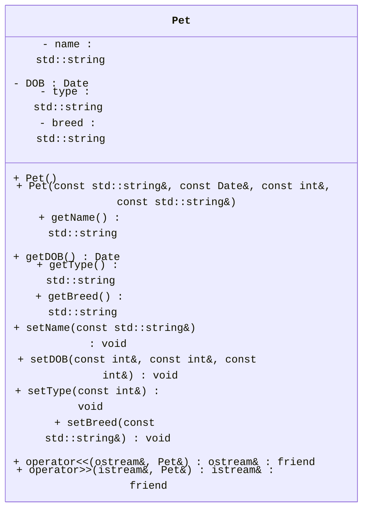
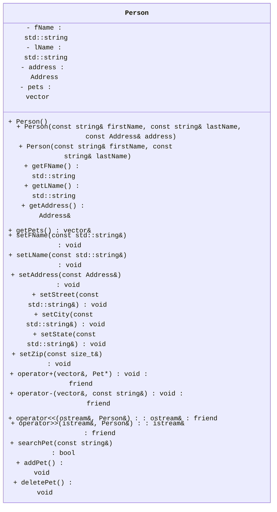

<link rel="stylesheet" href="https://cdnjs.cloudflare.com/ajax/libs/font-awesome/6.0.0-beta3/css/all.min.css">


## Vet's Office

1. In the `src` directory, create `.cpp` and `.h` files for the `Address`, `Pet` and `Person` classes. 
  - the `.h` file must contain only the declaration (prototypes).
    - Your header file should start (other than comments) with the lines:
      - `#ifndef <CLASS_NAME>_H`
      - `#define <CLASS_NAME>_H`
      - If class name is 'Address' then header file will have `#ifndef ADDRESS_H` and `#define ADDRESS_H`.
    - The very last line in the file should be:
      - `#endif`
  - the `.cpp` file must contain the implementation of the class methods.
  - Don't forget everything in C++ is case-sensitive. This includes file names.
    - Files storing Class information should be capitalized as are their classes.
2. The `Date` class:
   - This class is <strong>already implemented</strong>. You <strong>don't have to modify anything</strong> in this class.
   - You will use the constructors of `Date` class to set the date in the `Pet` class.
   - You will use the `dateString` method to get the Date in specific format.
3. The `Address` class:
   - **Member Variables**
     - a `string` that holds the street name - **`street`**
     - a `string` that holds the city name - **`city`**
     - a `string` that holds the state name - **`state`**
     - a `size_t` that holds the zip code - **`zipCode`**
   - **Constructors**
     - a default constructor that takes no parameters.
     - a parameterized constructor that takes values for each member variable in the above order to create an `Address` object.
   - **Member Functions/Methods**
      - Getters & Setters (aka Mutators & Accessors) for each member variable [8 in total].
      - Notice that in setDOB(), you will using parameters to build a new Date object but in the constructor, an existing Date object will be passed.
      - All `string` variables will have values stored in <strong>upper-case</strong> only.
      -  The `operator>>` function takes `istream&` (for `cin`) and `Address&` (for `Address` object ) as parameters and returns `istream&` (for `cin`). It will be declared as a `friend` of `Address` class.
      - The `overloaded >>` operator sets the values for all member variables using user input.
         The Autograder will send inputs in the following sequence. As always, the <> aren't included in the actual inputs. A new line indicates that the enter/return key has been pressed:
         ```
         <STREET>
         <CITY>
         <STATE>
         <ZIPCODE>
         ```
         **Be extra careful managing your input stream!**
      - The `operator<<` function takes `ostream&` (for `cout`) and `Address&` (for `Address` object ) as parameters and returns `ostream&` (for `cout`). The `overloaded <<` operator displays the `Address` object in format specified below.  It will be declared as a `friend` of `Address` class.
         - the output must match the following format exactly! What is between the <> will be your member variables. Do not include the <> characters in your output. Be sure to end each line.
         - The left side of the ':' will be a field of 13 characters, then the colon character ':', then a field of 21 characters for a total of 35 characters.
```
STREET       :             <Street>
CITY         :               <City>
STATE        :              <State>
ZIP CODE     :                <zip>
```
4. The `Pet` class:
   - **Member Variables**
     - a `string` that holds the pet name - **`name`**
     - a `Date` that holds the date of birth - **`DOB`**
     - a `string` that holds the pet type - **`type`**
     - a `string` that holds the breed - **`breed`**
   - **Constructors**
     - a default constructor that takes no parameters.
     - a full parameterized constructor that takes values for each member variable in the above order to create a `Pet` object. Use constructor for `Date` class to set `DOB` 
   - **Member Functions/Methods**
      - Getters & Setters (aka Mutators & Accessors) for each member variable [8 in total].
      - All `string` variables will have values stored in <strong>upper-case</strong> only.
      - `setType` will take a `const int &` as input and sets the `type` using below values (should implement using `switch-case` only).
         - `1` : `DOG`
         - `2` : `CAT`
         - `3` : `BIRD`
         - `4` : `SNAKE`
         - If any other values are passed as input (default), then the type will be specified by user-input.
      - The `operator>>` function takes `istream&` (for `cin`) and `Pet&` (for `Pet` object ) as parameters and returns `istream&` (for `cin`).
      - The `overloaded >>` operator sets the values for all member variables using user input.  It will be declared as a `friend` of `Pet` class.
        The Autograder will send inputs in the following sequence. As always, the <> aren't included in the actual inputs. A new line indicates that the enter/return key has been pressed:
         ```
         <NAME>
         <MONTH>
         <DAY>
         <YEAR>
         <TYPENUM>
         <TYPENAME> // *only* if TYPENUM isn't 1-4!
         <BREED>
         ```
         **Be extra careful managing your input stream!**
       - The `operator<<` function takes `ostream&` (for `cout`) and `Pet&` (for `Pet` object ) as parameters and returns `ostream&` (for `cout`). The `overloaded <<` operator displays the `Pet` object in format specified below.  It will be declared as a `friend` of `Pet` class.
         - the output must match the following format exactly! What is between the <> will be your member variables. Do not include the <> characters in your output. Be sure to end each line.
         - The left side of the ':' will be a field of 13 characters, then the colon character ':', then a field of 21 characters for a total of 35 characters.
         - Use `dateString` function in `Date` class to print the `DOB`.
```
NAME         :               <Name>
DOB          :                <DOB>
TYPE         :               <Type>
BREED        :              <breed>
```

5. The `Person` class:
   - **Member Variables**
     - a `string` that holds the first name - **`fName`**
     - a `string` that holds the last name - **`lName`**
     - a `Address` that holds the address- **`address`**
     - a `vector<Pet*>` that holds the pointers to Pet objects - **`pets`**
   - **Constructors**
     - a default constructor that takes no parameters.
     - a parameterized constructor that takes first name, last name and address as parameters to create a `Person` object.
     - a parameterized constructor that takes first name and last name as parameters to create a `Person` object.
   - **Member Functions/Methods**
      - Getters & Setters (aka Mutators & Accessors) for each member variable [11 in total].
        - Setters will be implemented for each member variable of `Address` class as well.
      - All `string` variables will have values stored in <strong>upper-case</strong> only.
      - The `operator>>` function takes `istream&` (for `cin`) and `Person&` (for `Person` object ) as parameters and returns `istream&` (for `cin`). It will be declared as a `friend` of `Person` class.
        - The `overloaded >>` operator sets the values for first name, last name and address using user input.
          The Autograder will send inputs in the following sequence. As always, the <> aren't included in the actual inputs. A new line indicates that the enter/return key has been pressed:
         ```
         <FNAME>
         <LNAME>
         <STREET>
         <CITY>
         <STATE>
         <ZIPCODE>
         ```
         **Be extra careful managing your input stream!**
      - a `public` function called `searchPet` which takes a `string` as a parameter and returns a `bool` value.
           - The `string` parameter specifies the name of the `Pet` to search for.
           - The function will search the `pets` vector and returns `true` if a `Pet` with the provided name is found. Else, returns `false`.   
      - a `public` function called `addPet` which takes no parameters and returns nothing.
           - The function will create a `Pet` object dynamically.
           - Then the member variables of the `Pet` object will be set through user-input (using the `overloaded >>` operator defined for `Pet` object will be easier).
           - If a `Pet` with same name is not present in the `pets` vector, then the pointer to the updated `Pet` object will be pushed into the `pets` vector using the `overloaded +` operator. Otherwise, throw an exception of type const char* with message: `"Pet with same name already exists."`. In other words, throw the message string by itself without an exception wrapper (like std::invalid_argument).
           - An `overloaded +` operator, which will be a friend of `Person` class, pushes a pointer to `Pet` object into the `pets` vector. The `operator+` function takes `vector<Pet*>` (for `pets` vector) and `Pet*` (for Pet to add) as input and returns nothing.
      - a `public` function called `deletePet` which takes no parameters and returns nothing.
           - The function will ask the user to input the name of the `Pet` to be deleted. user-input should be converted to <strong>upper-case</strong> as all strings will be in upper-case.
           - If a `Pet` with provided name exists in the `pets` vector, then it will be deleted using the `overloaded -` operator. Otherwise, throw an exception of type const char* with message: `"Pet not found."`.
           - An `overloaded -` operator, which will be a friend of `Person` class, deletes a pointer to `Pet` object from the `pets` vector. The `operator-` function takes `vector<Pet*>` (for `pets` vector) and `string` (for pet name) as input and returns nothing.
       - The `operator<<` function takes `ostream&` (for `cout`) and `Person&` (for `Person` object ) as parameters and returns `ostream&` (for `cout`). The `overloaded <<` operator displays the `Person` object in format specified below.  It will be declared as a `friend` of `Person` class.
         - The output must match the following format exactly! What is between the <> will be your member variables. Do not include the <> characters in your output. Be sure to end each line.
         - The left side of the ':' will be a field of 13 characters, then the colon character ':', then a field of 21 characters for a total of 35 characters.
         - `Address` and `Pet` can be displayed using the `overloaded <<` operators implemented for specific classes.
         - All `Pet`s in `pets` vector should be displayed using a for loop, each `Pet` information will be seperated by a newline.
         - THe ADDRESS and PETS LIST lines will also be on a field of 13 and aligned left. Pay special attention to new line spacing as well.
         - <strong>If there are no pets under the person then display 'NONE' under 'PETS LIST' </strong>. 

```
FIRST NAME   :          <FirstName>
LAST NAME    :           <LastName>

ADDRESS      
STREET       :             <Street>
CITY         :               <City>
STATE        :              <State>
ZIP CODE     :                <zip>

PETS LIST    
NAME         :               <Name>
DOB          :                <DOB>
TYPE         :               <Type>
BREED        :              <breed>

NAME         :               <Name>
DOB          :                <DOB>
TYPE         :               <Type>
BREED        :              <breed>
```


### Below is the **UML** representation of the class `Date`.



### Below is the **UML** representation of the class `Address`.



### Below is the **UML** representation of the class `Pet`.



### Below is the **UML** representation of the class `Person`.



### Specifications

- The `main.cpp` should have a menu asking if the user wishes to Enter a person, ENter a new pet, modify a pet, Delete a pet.
- To make life easier for your client all letters will be stored in uppercase regardless of how they are entered.
- It is strongly recommended that you make your classes friends.
- <strong> Extra Credit: (10pts) </strong> Add the ability to modify a pet or address. This must be a function outside the classes. It can be a friend function.


